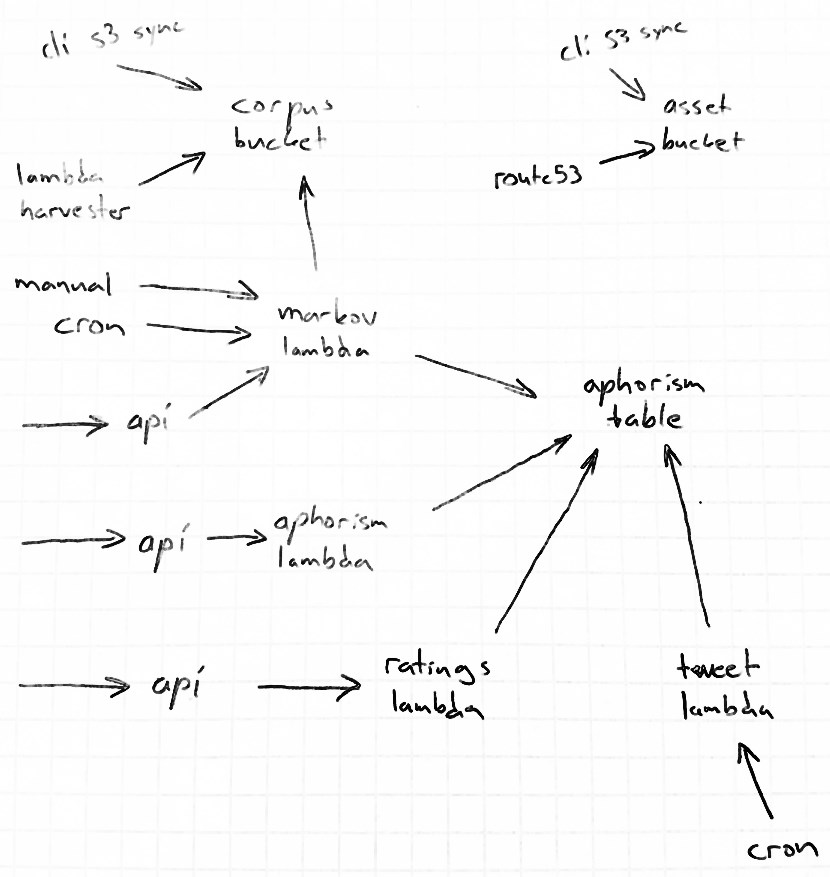

# Infinimonkey

According to the [infinite monkey theorem](https://en.wikipedia.org/wiki/Infinite_monkey_theorem), with enough monkeys and time, you will be able to randomly produce the works of William Shakespeare. I do not have the time for that, so let's lower the bar a little:

- Instead of monkeys and typewriters, we will have cyborg monkeys from [AWS](https://aws.amazon.com/)
- Instead of randomness, we will use [Markov chains](https://en.wikipedia.org/wiki/Markov_chain)
- Instead of Shakespeare, we will aim at level of ordinary shitty tweets

We will also find out how well Markov chains work with Finnish. Initial tests seem promising:

- *"Nightwish ja Children of Bodom ja Stratovarius ovat julkaisseet albumeita, jotka ovat kuntien ja yksityisten säätiöiden omistamia."*
- *"Peruskallio on monin paikoin yhteiskunnallista tyytymättömyyttä."*
- *"Pokémon on ollut mafiamaista touhua."*
- *"Tätä aiemmin läänejä oli Ahvenanmaa mukaan lukien Aamulehti, Iltalehti ja Kauppalehti."*
- *"Kuuluisia suomalaistaiteilijoita ovat esimerkiksi liito-orava ja rusakko."*
- *"Suomen somalit ovat kasvaneet voimakkaasti."*
- *"Uskonnoissa on se suojattava työasemakohtaisella palomuuriohjelmalla."*

## Planned architecture

